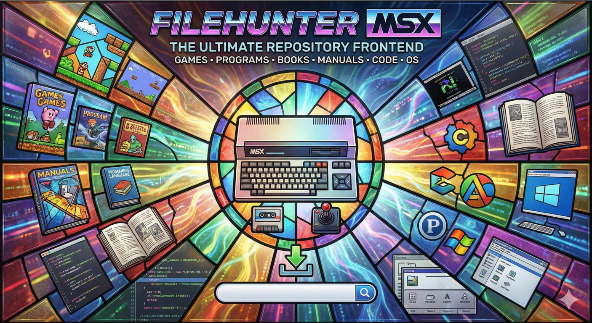
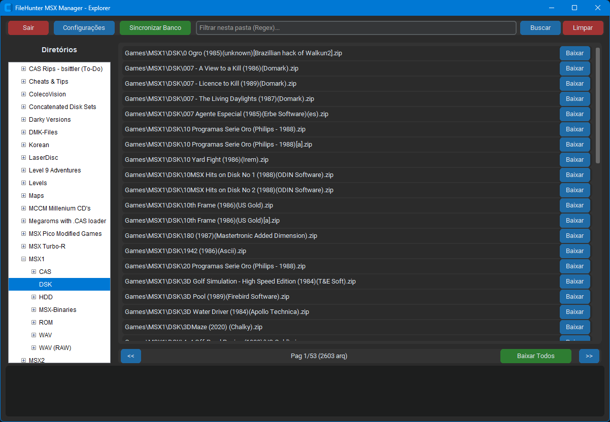

# FileHunter MSX Manager 🎮



O **FileHunter MSX Manager** é um frontend moderno em Python desenvolvido para gerenciar e sincronizar a base de dados de arquivos do repositório [File-Hunter](https://www.file-hunter.com/), um dos maiores acervos dedicados à plataforma MSX.

## 📋 Sobre o Projeto

Este software automatiza o processo de catalogação de arquivos (ROMs, Disk Images, etc), baixando as listagens oficiais (`allfiles.txt` e `sha1sums.txt`) e armazenando-as em um banco de dados local SQLite. Ele permite que usuários de MSX mantenham uma cópia local organizada e sempre atualizada da estrutura de arquivos do site, com verificação automática de integridade.



## ✨ Funcionalidades Atuais

- **Interface Híbrida Inteligente**: O gerenciador de arquivos pode ser executado como uma janela independente ou embutido diretamente na tela principal do aplicativo.
    - *Update*: Corrigido erro de hierarquia (`AttributeError: 'AllFilesWindow' object has no attribute 'tk'`) ao acessar configurações em modo embutido.
- **Navegação Estilo Explorer Clássico**: Painel de diretórios à esquerda e listagem de arquivos à direita para uma experiência intuitiva.
- **Categorização Relacional**: Processamento automático da estrutura de diretórios do servidor para navegação hierárquica.
- **Busca Recursiva por Pastas**: Ao selecionar um diretório, o sistema exibe todos os arquivos contidos nele e em seus subdiretórios (Aggregation View).
- **Splash Screen com Efeito Fade**: Inicialização elegante com redimensionamento dinâmico de imagem e transição suave.
- **Gerenciador de Arquivos Paginado**: Navegação fluida em milhares de registros com suporte a:
        - **Busca por Expressões Regulares (Regex)**: Filtragem poderosa de arquivos.
        - **Download em Massa**: Botão "Baixar Todos" disponível para coleções completas em diretórios finais.
        - **Verificação de Integridade (SHA1)**: Confirmação automática após o download para garantir que o arquivo não foi corrompido.
        - **Execução Inteligente (openMSX)**: Integração direta com o emulador openMSX, detectando automaticamente o tipo de mídia (Disk ou ROM) através da estrutura de pastas e extensões.
        - **Log de Conferência**: Exibição em tempo real da linha de comando enviada ao emulador na área de status, facilitando o ajuste de configurações.
        - **Temas Customizáveis**: Suporte total a temas Dark/Light via configurações integradas ao banco de dados.

    ## 🛠️ Estabilidade e Correções Recentes

    - **Update (Lançador openMSX)**: Implementada a detecção dinâmica de tipos de mídia via caminhos absolutos. Arquivos em diretórios `\DSK\` são montados automaticamente no Drive A (`-diska`), enquanto arquivos em `\ROM\` (incluindo `.MX1` e `.MX2`) são carregados como cartuchos (`-carta`).
    - **Fix (Execução no Windows)**: Adicionadas flags de criação de processo (`DETACHED_PROCESS`) e definição de diretório de trabalho (`cwd`), garantindo que o emulador abra corretamente mesmo quando o caminho possui espaços.
    - **Melhoria na UI**: O comando completo de execução agora é mostrado no console de status para conferência do usuário.

    ## 🚀 Próximos Passos (Roadmap)

    - **Suporte a Novas Mídias**: Implementação do carregamento de fitas cassete (`.CAS`) no openMSX.
    - **Visualizador de Documentos e Mídia**: Integração de visualização nativa (ou via sistema) para arquivos PDF (manuais) e imagens (capas/screenshots).
    - **Configurações Individuais por Título**: Permitir que cada jogo/programa tenha sua própria configuração de máquina e extensões, possibilitando rodar um programa específico em MSX2+ enquanto o padrão do sistema é MSX1.
    - **Execução de Outros Tipos**: Suporte para outros formatos de arquivos reconhecidos pelo ecossistema MSX.

    ## 🚀 Como Usar


### Pré-requisitos
- **Python 3.10** ou superior (testado no 3.14).
- Conexão com a internet para sincronização inicial.

### Instalação
1. **Clone o repositório**:
   ```bash
   git clone https://github.com/seu-usuario/filehunter-msx-manager.git
   cd filehunter-msx-manager
   ```

2. **Crie e ative seu ambiente virtual**:
   ```bash
   python -m venv .venv
   # Windows:
   .venv\Scripts\activate
   # Linux/Mac:
   source .venv/bin/activate
   ```

3. **Instale as dependências**:
   ```bash
   pip install -r requirements.txt
   ```

### Execução e Fluxo de Trabalho
1. **Inicie o App**:
   ```bash
   python main.py
   ```
2. **Sincronize o Banco**: Na primeira execução, clique em **Sincronizar Banco**. O app baixará as definições do servidor File-Hunter e populará seu banco de dados local (`database/filehunter.db`).
3. **Navegue e Baixe**: Use a árvore de diretórios para explorar as categorias. Clique em "Baixar" para obter um arquivo individual ou use a busca para encontrar itens específicos.
4. **Execute**: Após o download bem-sucedido e a verificação do SHA1, o botão mudará para "Exec", permitindo abrir o arquivo diretamente no seu emulador ou visualizador padrão.

## 🛠️ Tecnologias Utilizadas

- **Python 3.14**
- **CustomTkinter**: Interface gráfica moderna com widgets customizados.
- **SQLite3**: Banco de dados relacional para indexação e cache.
- **Requests**: Gestão de downloads e comunicação com o servidor.
- **Pillow (PIL)**: Processamento de imagens da interface e splash screen.
- **Hashlib**: Cálculo de SHA1 para segurança de dados.

---
*Este projeto não possui vínculo oficial com o site File-Hunter, sendo uma ferramenta feita por fãs para a comunidade MSX.*