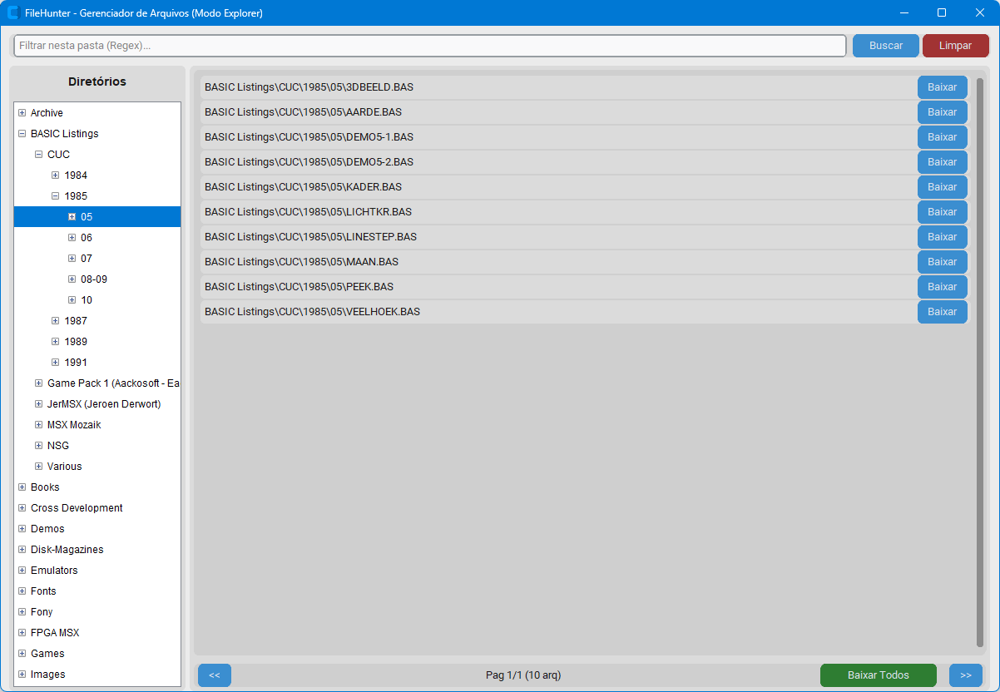

# FileHunter MSX Manager 🎮


O **FileHunter MSX Manager** é um frontend moderno em Python desenvolvido para gerenciar e sincronizar a base de dados de arquivos do repositório [File-Hunter](https://www.file-hunter.com/), um dos maiores acervos dedicados à plataforma MSX.

## 📋 Sobre o Projeto

Este software automatiza o processo de catalogação de arquivos (ROMs, Disk Images, etc), baixando as listagens oficiais (`allfiles.txt` e `sha1sums.txt`) e armazenando-as em um banco de dados local SQLite. Ele permite que usuários de MSX mantenham uma cópia local organizada e sempre atualizada da estrutura de arquivos do site, com verificação automática de integridade.



## ✨ Funcionalidades Atuais

- **Navegação Estilo Explorer Clássico**: Interface inspirada no File Manager do Windows 3.1 com painel de diretórios à esquerda e listagem de arquivos à direita.
- **Categorização Inteligente**: Processamento automático do `ALLFILES.TXT` para criação de uma estrutura relacional de categorias e subcategorias aninhadas.
- **Busca Recursiva por Pastas**: Ao selecionar um diretório, o sistema exibe automaticamente todos os arquivos contidos nele e em seus subdiretórios (Aggregation View).
- **Expansão Automática de Árvore**: Navegação fluida que abre subpastas automaticamente quando o diretório pai atua apenas como contêiner.
- **Splash Screen Animada**: Inicialização elegante com efeito de fade-out baseada em imagem customizada.
- **Sincronização Inteligente**: Compara a data da última atualização no servidor e limpa prefixos para garantir compatibilidade perfeita.
- **Gerenciador de Arquivos Paginado**: Navegação ultra rápida em milhares de registros sem travamentos da interface.
    - **Busca por Expressões Regulares (Regex)**: Filtragem poderosa que funciona em conjunto com a seleção de categorias.
    - **Download em Massa Inteligente**: Botão "Baixar Todos" que aparece automaticamente ao atingir o último nível de diretório, permitindo baixar coleções completas respeitando a estrutura de pastas original.
    - **Sistema de Downloads com Verificação**:
      - Reconstrói a estrutura original localmente no diretório `/downloads`.
  - Verifica automaticamente o **SHA1** pós-download.
  - Botão dinâmico para **Executar** caso o arquivo já exista localmente.
- **Interface Moderna**: Construído com `CustomTkinter` com suporte total a temas Dark/Light.

## 🚀 Como Usar
// ... existing code ...

### Pré-requisitos
- Python 3.10 ou superior.
- Virtualenv (recomendado).

### Instalação
1. Clone o repositório:
   ```bash
   git clone https://github.com/seu-usuario/filehunter-msx-manager.git
   cd filehunter-msx-manager
   ```

2. Crie e ative seu ambiente virtual:
   ```bash
   python -m venv .venv
   # Windows:
   .venv\Scripts\activate
   # Linux/Mac:
   source .venv/bin/activate
   ```

3. Instale as dependências:
   ```bash
   pip install -r requirements.txt
   ```

### Execução
Certifique-se de que o arquivo `splashscreen.png` está na pasta raiz e inicie a aplicação principal:
```bash
python main.py
```


## 🛠️ Tecnologias Utilizadas

- **Python 3.14**
- **CustomTkinter**: Interface gráfica moderna.
- **SQLite3**: Banco de dados local para indexação rápida.
- **Requests**: Download de metadados e arquivos.
- **Pillow (PIL)**: Manipulação de imagens e Splash Screen.
- **Hashlib**: Verificação de integridade SHA1.